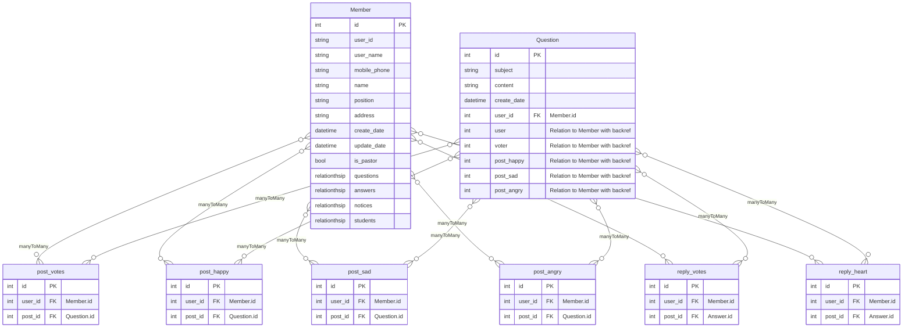
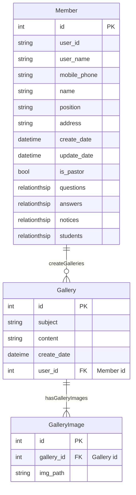

# 브니엘 시스템 ER Diagram

## 자유게시판 게시글/댓글 추천 기능

- 게시글(post) 추천 종류
  - 추천해요(recommand)
  - 행복해요(happy)
  - 슬퍼요ㅠ(sad)
  - 화나요!!(angry)
- 댓글(reply) 추천 종류
  - 엄지척(thumb up)
  - 사랑해요(heart)

- 추천 종류는 DB Table로 연결 $\to$ Many to Many Relation
  - 한 명의 User는 여러 게시글을 추천할 수 있다. 대신 하나의 게시글에는 하나의 추천만 할 수 있다.
  - 하나의 게시글은 여러 명에게 추천 받을 수 있다. 대신 동일한 게시글은 여러개일 수 없다..

## Gallery ER Diagram

