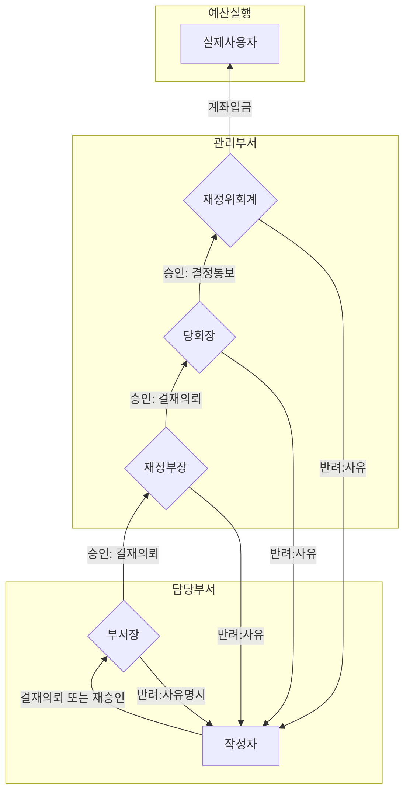
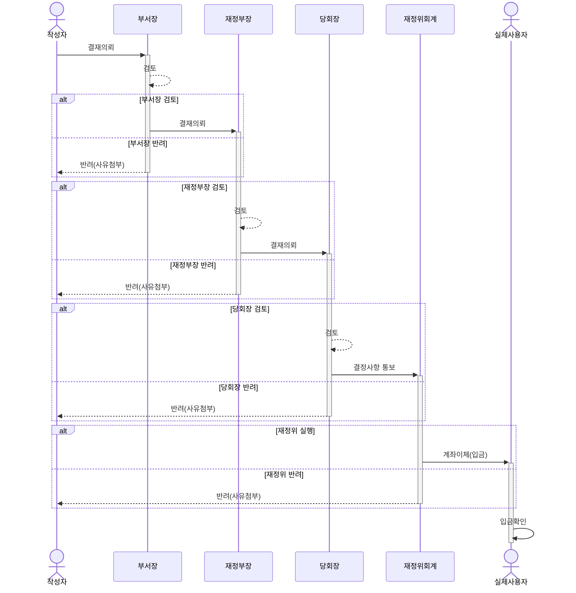
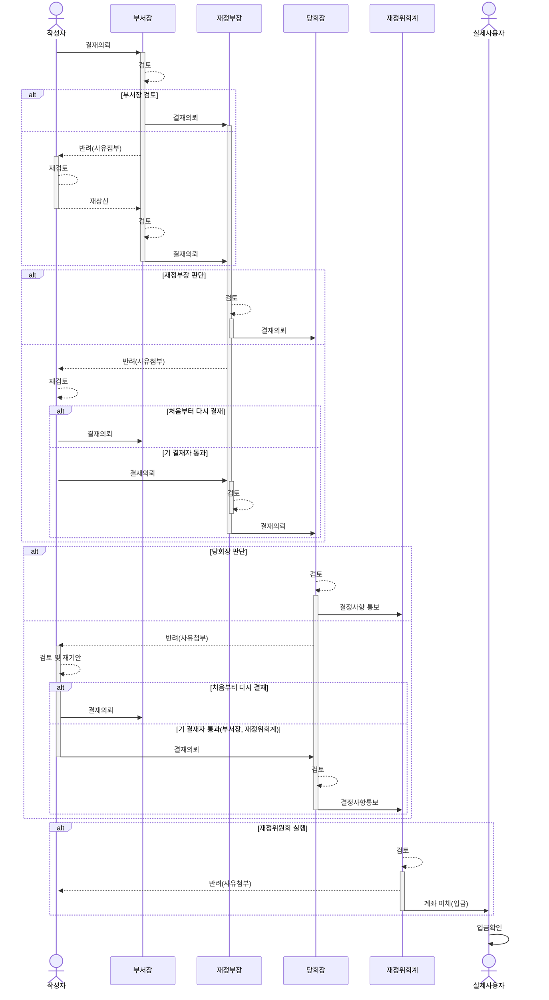

# 회계결재 시스템

## 시스템 상태(`state`) 정의

회계시스템 상태를 정의합니다.

|상태|설명|상태정의|자료형|적용|
|:--|:--|:--|:--|:--|
|작성|담당자가 회계양식을 작성하고 저장 완료|`created`|`boolean`|작성자|
|결재중|작성자가 양식을 상위 결재자에게 승인 의뢰한 경우 |`in_process`|`boolean`|모든 참여자|
|결재대기|하위 담당자의 상태가 `결재중` 상태인 경우|`wait`|`boolean`|모든 참여자|
|승인|참여자가 `결재대기` 양식을 결재 처리한 경우|`approved`|`boolean`|작성자|
|반려|참여자가 `결재대기` 양식을 기각 처리한 경우|`rejected`|`boolean`|작성자|
|완료|작성자를 제외한 모든 참여자가 결재한 경우|`completed`|`boolean`|모든 참여자|

## 사용자 서류함 정의

- 서류함 관련 용어정의
  - 작성자: 교사 권한을 갖는 모든 교인
    - 해당 부서에서 지정 (예: 브니엘 청소년부 교사 권한은 담당목사 또는 부장이 지정)
  - 참여자
    - 교회 회계시스템 결재 라인에 있는 교인
    - 참여자는 교회에서 지정한 권한을 가진 목회자가 지정(예: 담임목사 등)
  - 결재라인
    - 회계시스템을 이용하여 다음 절차를 진행하는 과정에서 발생하는 업무라인
      - 양식작성 $\to$ 결재의뢰 $\to$ 중간결재 $\to$ 최종결재 $\to$ 예산집행

- 서류함 종류

    |서류함|설명|적용|
    |:--|:--|:--|
    |`작성`|담당자가 회계양식을 작성/저장, 결재의뢰 하지 않은 문서|작성자|
    |`진행`|담당자가 회계양식을 작성/저장, 결재의뢰한 문서|작성자|
    |`반려`|결재의뢰한 문서가 결재라인에서 반려된 문서|작성자|
    |`대기`|작성자 또는 하위결재자가 승인한 문서|모든 결재라인 참여자|
    |`완료`|모든 결재 라인의 참여자가 승인한 문서|모든 결재라인 참여자|

## 결재 라인 정의

### 업무 흐름도

### 개략 업무 절차

### 소프트웨어 구현 세부 절차

## 기 결재자 통과 기능

- 아래 조건을 만족할 경우 `기 결재자 통과` 기능 활성화
  - 중간 결재자는 승인, 중간 결재자의 상위 결재자가 반려하는 경우
- 반려 이벤트가 발생할 경우 해당 내용은 작성자에게 돌아감(`return`)
- 작성자는 반려함 목록을 조회할 수 있음
- 작성자는 반려 내용을 확인하여 문서를 수정할 수 있음
- 작성자는 기 결재자를 통과하여 반려자에게 직접 재승인 가능